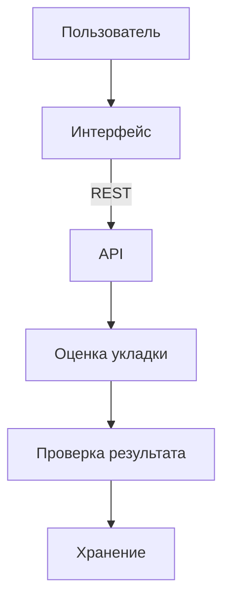

# Архитектура

Как устроен BoneCheck AI: интерфейс, API, оценка укладки и хранение.

Оглавление: [README.md](../README.md).

Пользователь работает только с интерфейсом. Интерфейс обращается к API. Разбор изображения в браузере не запускается.



## Интерфейс

Каталог `frontend/`. React, TypeScript, Vite.

Маршруты:

| Адрес | Экран |
| --- | --- |
| `/` | Проверка исследования |
| `/history` | История исследований |
| `/history/:id` | Карточка исследования |

Интерфейс хранит в браузере технический идентификатор сессии. По нему раздел «Мои» отделяется от общей истории. Это не учётная запись.

Адрес API задаётся переменной `VITE_API_BASE_URL`. Если она не задана, интерфейс обращается к локальному `http://localhost:3000`. На публичном стенде эта переменная указывает на https://bonecheck-backend.onrender.com.

Прямой заход на `/history` и `/history/:id` должен получить тот же `index.html`, что и главная. Дальше маршрут разбирает React Router. Для статического сайта на Render это rewrite `/*` → `/index.html`. Файл сборки по этому пути не подменяется: `/assets/*` и `/favicon.svg` отдаются как файлы. Настройка: [deployment/README.md](../../deployment/README.md).

## API

Каталог `backend/`. NestJS, TypeScript.

API принимает файл, проверяет его, сохраняет исследование и отдаёт статус, результат, снимок и XLSX.

Ответ на загрузку не ждёт окончания проверки. Статус сразу «Идёт анализ». Клиент опрашивает исследование, пока оно не станет «Готово» или «Ошибка анализа».

Ошибки приходят одним JSON: `statusCode`, `error`, `code`, `message`. Для конфликта по результату добавляется `status` исследования.

Живое описание методов на публичном стенде: https://bonecheck-backend.onrender.com/api/docs

При локальном запуске то же описание: http://localhost:3000/api/docs

Маршрут в API — `GET /api/docs`.

## Обработка исследования

```text
файл принят
  -> исследование создано, статус «Идёт анализ»
  -> оценка укладки
  -> проверка формата результата
  -> «Готово» и результат
     или «Ошибка анализа» без результата
```

Одно исследование - один файл и не больше одного результата. Несколько исследований обрабатываются независимо: ошибка одного не меняет остальные.

Повторно уже готовое исследование и исследование с ошибкой анализа не отправляются на проверку снова. Если сервис остановился, пока статус был «Идёт анализ», после запуска обработка таких записей продолжается.

Результат сохраняется только если он согласован: класс 0 или 1, область из двух допустимых, нарушения только из списка этой области. Несогласованный ответ не становится результатом.

Формат полей: [results.md](../product/results.md). Контракт оценки укладки описан в [ml/README.md](../ml/README.md). Модель к системе ещё не подключена: публичный стенд до интеграции отвечает временной заглушкой. Что именно показывает стенд: [limitations.md](../product/limitations.md).

## Хранение

Метаданные исследования и поля результата лежат в одном файле SQLite. Путь - `DATABASE_PATH`. На локальном запуске и в Docker этот файл находится на машине, где запущен API. На публичном стенде - на сервере стенда.

Сам DICOM лежит отдельно, в каталоге `UPLOAD_DIR`, в папке исследования. Путь к файлу в ответы API не входит. Снимок отдаётся методом `GET /api/studies/:id/file`.

Подробнее: [data.md](data.md).

## Состав запуска

Публичный стенд:

| Часть | Адрес |
| --- | --- |
| Интерфейс | https://bonecheck-ai.onrender.com/ |
| API | https://bonecheck-backend.onrender.com |
| Проверка API | https://bonecheck-backend.onrender.com/health |
| Описание API | https://bonecheck-backend.onrender.com/api/docs |

При локальном запуске и в Docker по умолчанию пользователь открывает свою машину:

| Часть | Адрес |
| --- | --- |
| Интерфейс | http://localhost:5173 |
| API | http://localhost:3000 |
| Проверка API | http://localhost:3000/health |
| Описание API | http://localhost:3000/api/docs |

В Docker порт хоста пробрасывается на порт процесса в контейнере. По умолчанию это `5173:5173` у интерфейса и `3000:3000` у API. `FRONTEND_PORT` и `BACKEND_PORT` меняют только левое число — порт хоста. Внутри контейнера интерфейс слушает 5173, API слушает 3000.

Контейнер `ml-service` публикует порт хоста `ML_SERVICE_PORT` (по умолчанию 8000) на порт 8000 внутри контейнера. Процесс — заглушка: HTTP не слушает, API к этому порту не обращается. http://localhost:8000 открывать не нужно.

Локальный запуск и Docker описаны в [running.md](running.md) и [deployment/README.md](../../deployment/README.md).

Локальный запуск и Docker Compose хранят снимки на машине, где запущен сервис. В сторонний сервис анализа они не отправляются.

Публичный стенд устроен иначе. Интерфейс на https://bonecheck-ai.onrender.com/ отправляет файл на https://bonecheck-backend.onrender.com. Снимок хранится на этом стенде, а не на компьютере пользователя. Входа в систему нет: список исследований и файл по идентификатору доступны тому, кто обращается к API стенда.

Дальше: [API](api.md).
