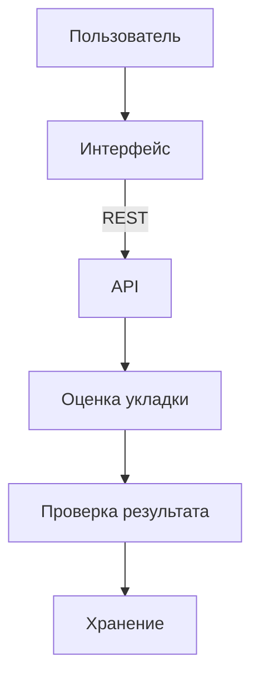

# Архитектура

Как устроен BoneCheck AI: интерфейс, API, оценка укладки и хранение.

Оглавление: [README.md](../README.md).

Пользователь работает только с интерфейсом. Интерфейс обращается к API. Разбор изображения в браузере не запускается.



## Интерфейс

Каталог `frontend/`. React, TypeScript, Vite.

Маршруты:

| Адрес | Экран |
| --- | --- |
| `/` | Проверка исследования |
| `/history` | История исследований |
| `/history/:id` | Карточка исследования |

Интерфейс хранит в браузере технический идентификатор сессии. По нему раздел «Мои» отделяется от общей истории. Это не учётная запись.

Адрес API задаётся переменной `VITE_API_BASE_URL`. Если она не задана, интерфейс обращается к `http://localhost:3000`.

## API

Каталог `backend/`. NestJS, TypeScript.

API принимает файл, проверяет его, сохраняет исследование и отдаёт статус, результат, снимок и XLSX.

Ответ на загрузку не ждёт окончания проверки. Статус сразу «Идёт анализ». Клиент опрашивает исследование, пока оно не станет «Готово» или «Ошибка анализа».

Ошибки приходят одним JSON: `statusCode`, `error`, `code`, `message`. Для конфликта по результату добавляется `status` исследования.

Живое описание методов: http://localhost:3000/api/docs. Маршрут в API - `GET /api/docs`.

## Обработка исследования

```text
файл принят
  -> исследование создано, статус «Идёт анализ»
  -> оценка укладки
  -> проверка формата результата
  -> «Готово» и результат
     или «Ошибка анализа» без результата
```

Одно исследование - один файл и не больше одного результата. Несколько исследований обрабатываются независимо: ошибка одного не меняет остальные.

Повторно уже готовое исследование и исследование с ошибкой анализа не отправляются на проверку снова. Если сервис остановился, пока статус был «Идёт анализ», после запуска обработка таких записей продолжается.

Результат сохраняется только если он согласован: класс 0 или 1, область из двух допустимых, нарушения только из списка этой области. Несогласованный ответ не становится результатом.

Формат полей: [results.md](../product/results.md). Pipeline: [ml/README.md](../ml/README.md).

```text
интерфейс
  -> POST /api/studies
  -> сохранение DICOM
  -> MlClient.analyze(storedFilePath)
  -> POST ML /analyze
  -> site_prediction
  -> проверка результата
  -> SQLite
  -> GET /api/studies/:id/result
```

`load_models()` выполняется один раз при старте Python-процесса, не на каждый снимок. Ошибка inference переводит только это исследование в «Ошибка анализа».

## Хранение

Метаданные исследования и поля результата лежат в одном локальном файле SQLite. Путь - `DATABASE_PATH`.

Сам DICOM лежит отдельно, в каталоге `UPLOAD_DIR`, в папке исследования. Путь к файлу в ответы API не входит. Снимок отдаётся методом `GET /api/studies/:id/file`.

Подробнее: [data.md](data.md).

## Состав запуска

При локальном запуске и в Docker по умолчанию пользователь открывает:

| Часть | Адрес |
| --- | --- |
| Интерфейс | http://localhost:5173 |
| API | http://localhost:3000 |
| Проверка API | http://localhost:3000/health |
| Описание API | http://localhost:3000/api/docs |

В Docker порт хоста пробрасывается на порт процесса в контейнере. По умолчанию это `5173:5173` у интерфейса и `3000:3000` у API. `FRONTEND_PORT` и `BACKEND_PORT` меняют только левое число - порт хоста. Внутри контейнера интерфейс слушает 5173, API слушает 3000.

Контейнер `ml-service` публикует порт хоста `ML_SERVICE_PORT` (по умолчанию 8000) на порт 8000 внутри контейнера. Это внутренний адрес API: `http://ml-service:8000`. Браузер туда не ходит. Каталог `backend/uploads` смонтирован в API и в ML как `/app/uploads`.

Локальный запуск и Docker описаны в [running.md](running.md) и [deployment/README.md](../../deployment/README.md).

Файлы обрабатываются локально. Изображения не отправляются во внешние сервисы.

Дальше: [API](api.md).
